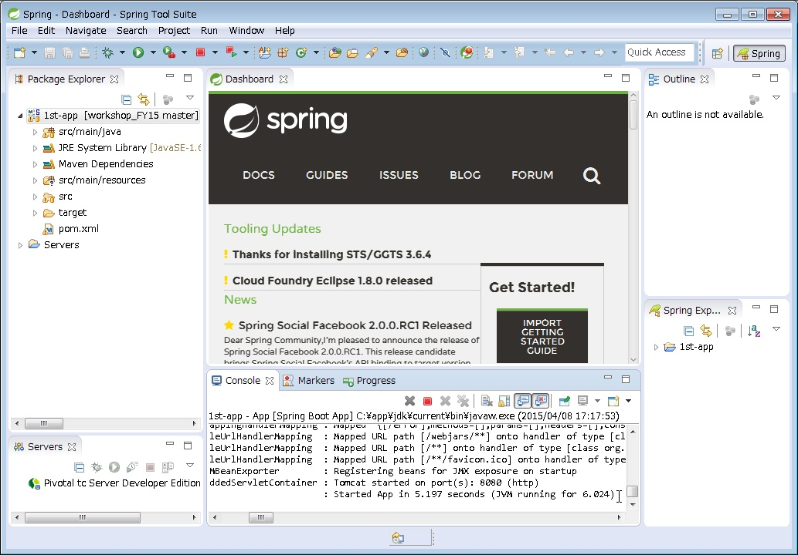

# STS(Spring Tool Suite)を利用したSpringベースアプリの開発

## STSのダウンロード

[STS公式サイト](https://spring.io/tools)より、最新のZipファイルをダウンロードする。

## STSの解凍・セットアップ

ダウンロードしたZipファイルを任意の場所に解凍。

解凍先\sts-bundle\sts-x.x.x.RELEASE\STS.exe
を実行。

workspaceは好きな場所またはデフォルトで良い。

