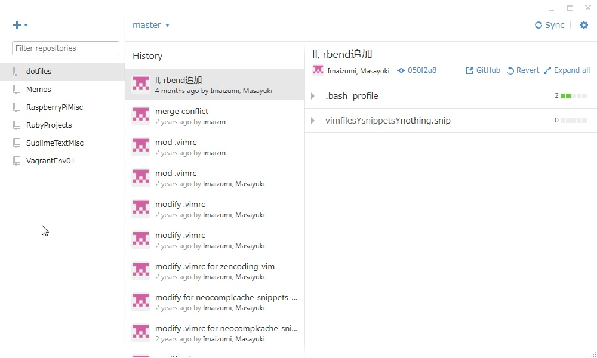
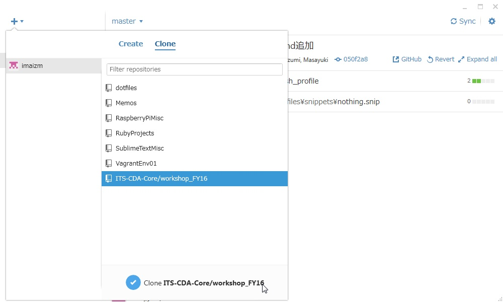
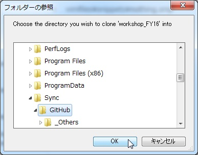
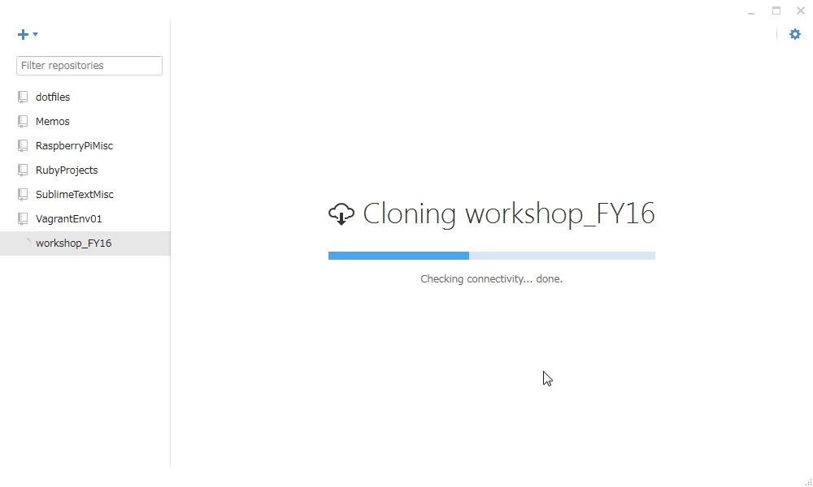
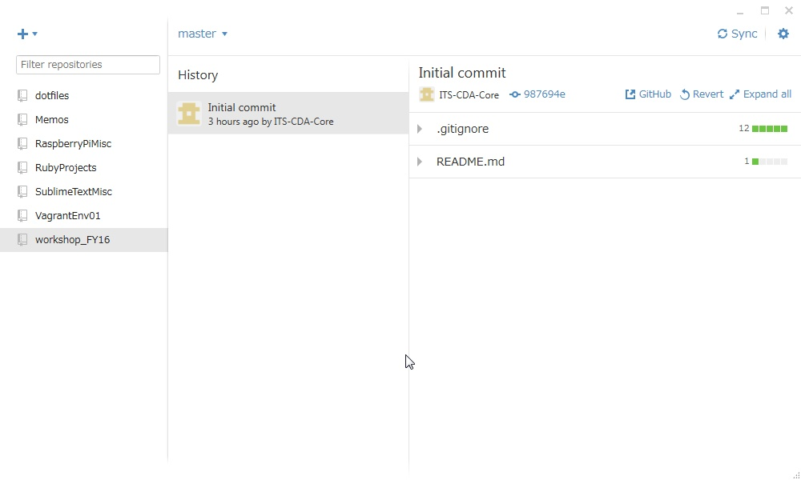

# GitHubClientを使ってGitHubからリソースを取得（clone）する手順

まずはGitHubClientを起動。

左上の「＋」ボタンを押下し、表示されるバルーンにて「Clone」を選択。

clone対象のレポジトリを選択。

自分自身のレポジトリは「レポジトリ名」で表示され、    
他ユーザのレポジトリは「他ユーザ名/レポジトリ名」で表示される。

表示されるフォルダー選択ダイアログにて、    
レポジトリのclone先を選択する。

cloneが完了するまで待つ。

cloneが完了すると、左サイドのレポジトリ一覧にcloneしたレポジトリが追加される。
