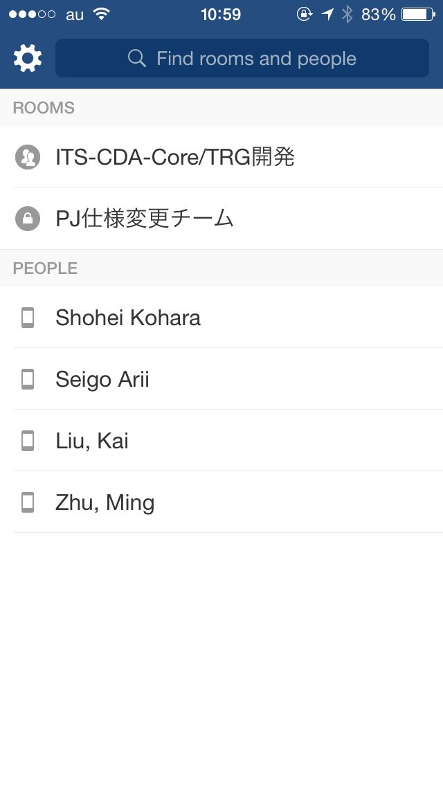
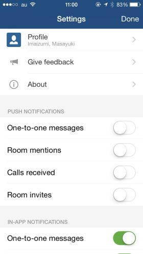
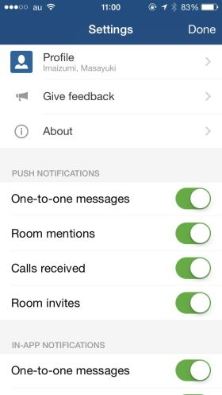
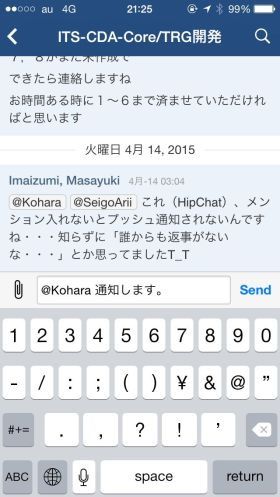
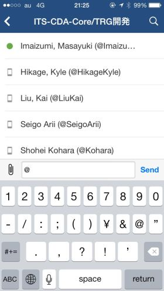
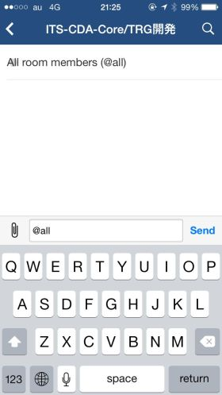

# スマホ版HipChatアプリのセットアップ手順

## アプリ設定の変更

ホーム画面より、左上の歯車マークをクリックする

初期状態では、「PUSH NOTIFICATION」の各項目が全てOFFに設定されている。

メンバー間の通知を見落とさないために、全ての項目をONに設定する。

## 主な操作方法

### 書き込み内容を他メンバーへ通知する

書き込み内容を任意のメンバーに通知するには、    
書き込み内容にメンション（@＋ユーザ名）を記載する。

メンションは、「@」を入力することにより、選択可能なユーザ名が表示されるようになっている。

「@all」と入力すると、チャットルーム内の全メンバーに通知を送ることが出来る。    
（ユーザ名選択には表示されず、自分で入力する必要があるが）
