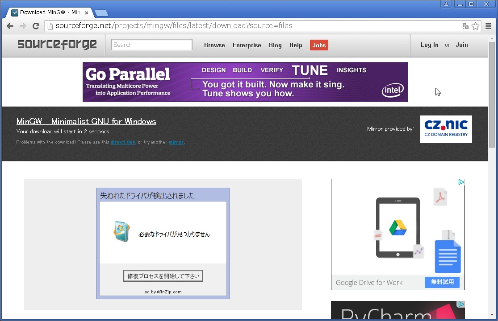

# [Winのみ]コマンドライン版ssh・rsync（MinGW）のセットアップ手順

「[www.mingw.org](http://www.mingw.org)」にアクセスし、右上の「Download Installer」ボタンをクリック。

自動でダウンロードが開始されるファイルを保存する。

保存したインストーラを起動し、初期画面にて「Install」をクリック。

インストール先を指定し、「Continue」ボタンをクリック。
以下では、インストール先として「C:\MinGW」を指定したと仮定する。

しばらく待つ。

「Continue」ボタンがクリック可能になったらクリックする。

左メニューの「All Packages->MSYS->MinGW Developer Toolkit」を選択し、
右上のリストから
・msys-openssh
・msys-rsync
のbin/doc/licを選択する。

ウィンドウメニューの「Installation->Apply Changes」を選択する。

表示されるダイアログにて、「Apply」ボタンをクリック。

ダウンロード＆インストールが終了し、「Colse」ボタンがクリック可能になったらクリックする。

システムのコントロールパネルを表示し、左メニューの「システムの詳細設定」をクリック。

「環境変数」ボタンをクリック。

システム環境変数「Path」を選択し「編集」ボタンをクリック。

変数値の末尾に、「;」＋「MinGWのインストール先パス」＋「\bin」を追記する。
（「C:\MinGW」にインストールした場合、「;C:\MinGW\bin」を追記）

「OK」をクリックしていき、コントロールパネルを閉じて終了。
