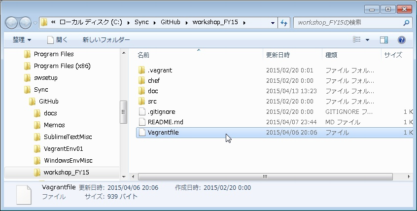
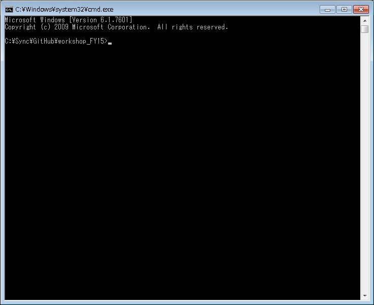
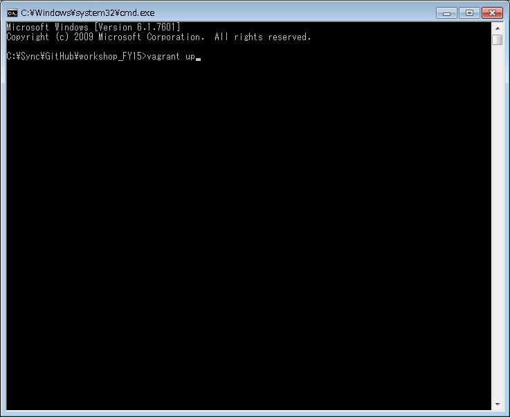
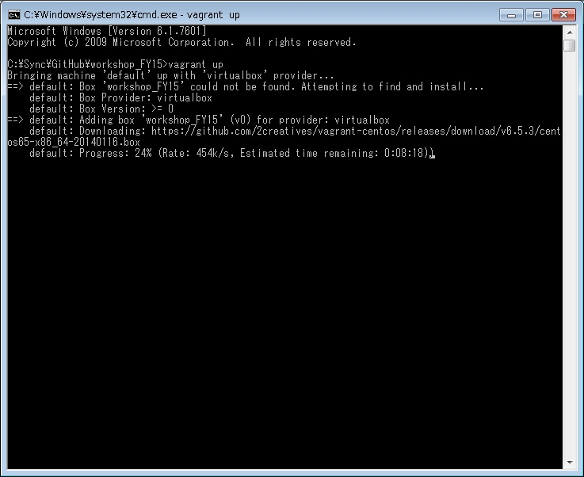
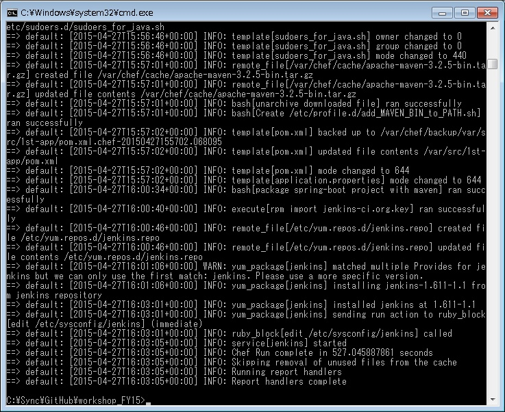
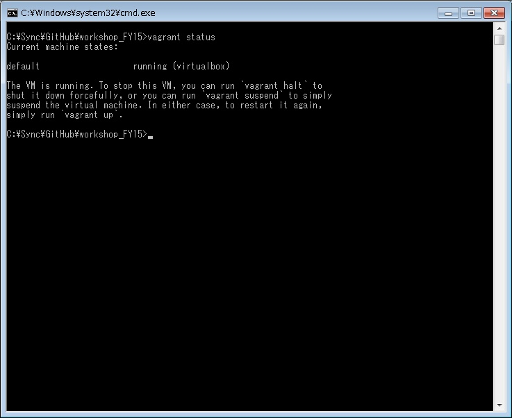

# 開発リソース内のVagrantスクリプトの起動方法

「Vagrantfile」が含まれるディレクトリ位置を確認する。    
ここでは仮に、「C:\Sync\GitHub\workshop_FY15」に配置されているケースを想定する。

コマンドプロンプト（ターミナル）を起動し、    
「Vagrantfile」が含まれるディレクトリまで移動する。

「vagrant up」と入力する。

初回は、OSイメージのダウンロードが実行されるため時間がかかる。（初回のみ）    
根気よく待つ。

「Report handlers complete」と表示されれば、起動完了。

念のため、VMが起動しているか確認するには、「vagrant status」と入力する。    
「running」と表示されれば起動中である。
