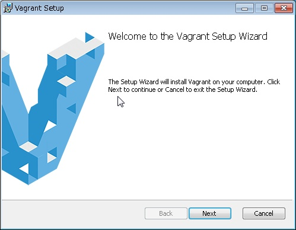
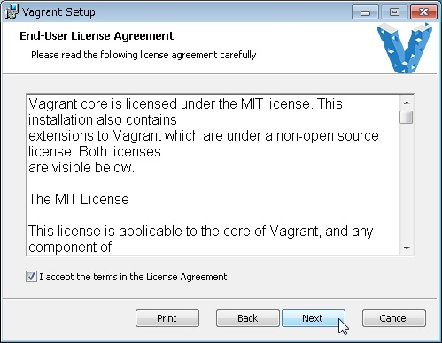
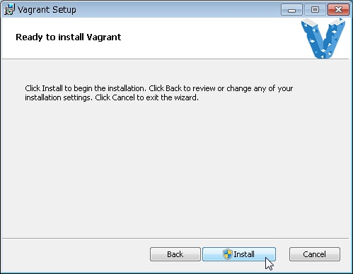
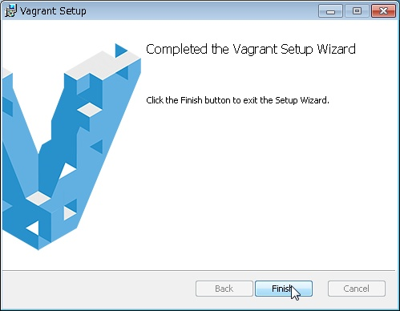

# Vagrantのセットアップ手順

## セットアッププログラムのダウンロード

[Vagrant公式サイト](https://www.vagrantup.com/)より、最新版のVagrantセットアッププログラムをダウンロードする。

## セットアッププログラムの起動

ダウンロードしたセットアッププログラムを起動する。



「Next」をクリック。



「I accept the term in the License Agreement」にチェックを入れ、  
「Next」をクリック。


インストール先を指定し、「Next」をクリック。  
インストール先はデフォルトのままでも良いが、ここでは後続の説明上  
「C:\Vagrant」を指定したとする。



「Install」をクリック。


インストールが完了するまで待つ。



「Finish」をクリック。


再起動を促されるため、都合の良いタイミングで再起動を実施する。

## プラグインのインストール

### vagrant-omnibus

```bash
vagrant plugin install vagrant-omnibus
```

上記コマンドにて、プラグインをインストールする。

```bash
vagrant plugin list
```

インストールされたか／されているかは上記コマンドにて確認できる。
