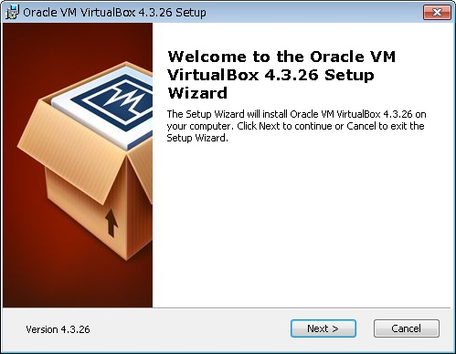
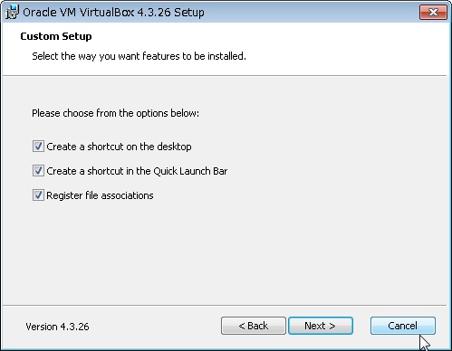

# VirtualBoxのセットアップ手順

## セットアッププログラムのダウンロード

[VirtualBox公式サイト](https://www.virtualbox.org/)より、最新版のVirtualBoxセットアッププログラムをダウンロードする。

## セットアッププログラムの起動

ダウンロードしたセットアッププログラムを起動する。

「Next」をクリック。

設定項目は何も変更する必要はなく（※）、
「Next」をクリック。

※変更してもよい。ただし、全featureをインストールした場合しか動作検証は行っていない。

設定項目は何も変更する必要はなく、
「Next」をクリック。

※変更してもよい。

注意事項を確認し、「Yes」をクリック。

（インストール作業中にネットワークの瞬断が発生するとのこと）

「Install」をクリック。

インストールが完了するまで待つ。

「Finish」をクリック。

（オプションは任意）
